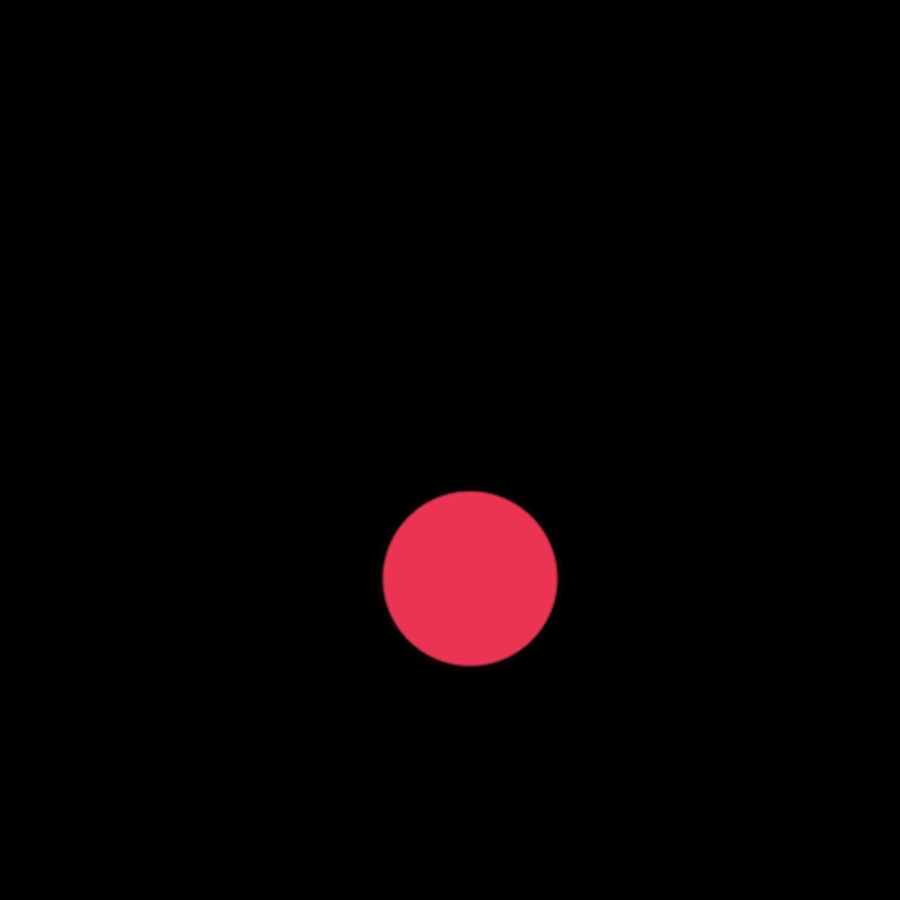
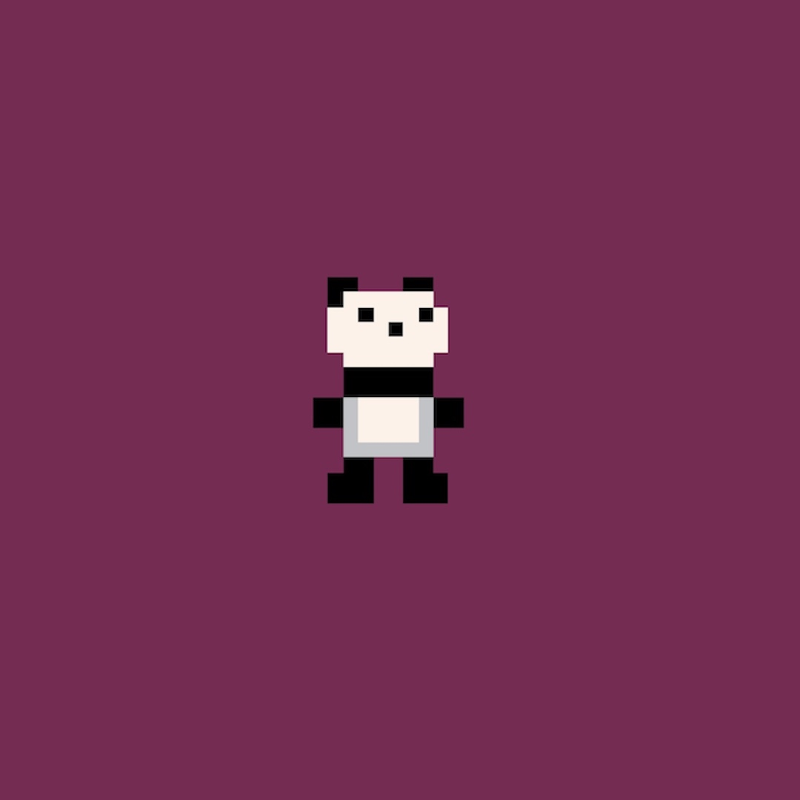
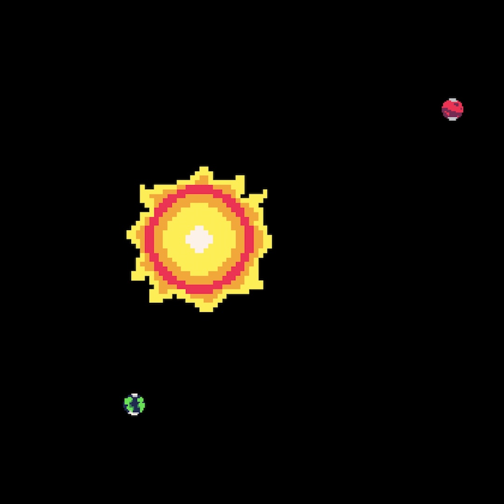

# Panda

Panda tries to make Canvas 2D less scary. (Still a work in progress.)

## Start
```bash
git clone --depth 1 https://github.com/esby-space/panda-canvas.git
cd panda-canvas
npx tsc
```
Then open `index.html` in a browser, and edit `scripts/main.ts`

## But why?

So you're going about your day just fine, and decide that you really want a red ball in your life! You reach for your trusty friend / enemy, Canvas 2D:

```javascript
const canvas = document.createElement('canvas');
const context = canvas.getContext('2d');

context.beginPath();
context.arc(200, 200, 50, 0, Math.PI * 2);
context.closePath();
context.fillStyle = 'red';
context.fill();
```
And we got a red circle! I think we deserve a nap too after writing so much code. Using Panda, this becomes:

```javascript
import panda from './panda/panda.js';

panda.init();
panda.draw.circle(200, 200, 50, { color: 'red' });
```

## Examples


1. Bouncing ball with gravity
   - basic drawings
   - basic physics
   - game loop
   - basic keyboard input


2. Controllable player and basic animation
   - sprite loading and rendering
   - sprite animation
   - more keyboard input
   - my really bad pixel art


3. Gravity and orbits
   - more physics
   - more of my really bad pixel art
4. Basic platformer
    - WIP
5. Basic game
   - WIP
   - pixel art "heavily inspired" by [aarthificial](https://www.youtube.com/watch?v=MZrp-FauId4)

## To do

- [ ] fix `panda.draw.text()`
- [ ] add more shapes to `panda.draw`
- [ ] add more rendering options to `panda.draw`
- [ ] improved `panda.init()`
  - retro pixel rendering! (where all pixels are aligned to grid)
- [ ] tilemap and background texture

## Future

- audio and music support
- add transformations for images and drawings
- add interface to interact with html elements
